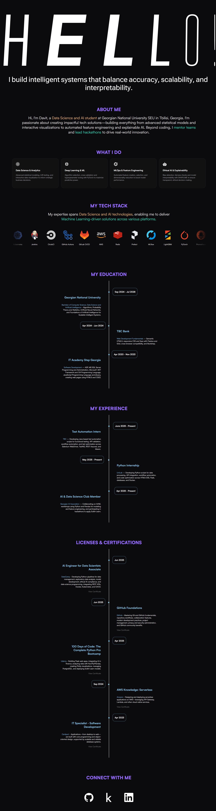

# Portfolio Website



A modern, interactive portfolio website designed to showcase skills, experience, and projects through custom animations and responsive layouts.

## ✨ Key Features

- **Dynamic Typography**
  - Variable font properties for interactive text
  - Proximity-based transformations on mouse hover
- **Spotlight Cards**
  - Dynamic spotlight positioning on hover
  - Fully customizable spotlight colors
- **Adaptive Layout**
  - Seamlessly responsive across all device sizes
  - Smooth transitions between viewports
- **Interactive Timelines**
  - Visual history for education, experience, and certifications
  - Elegantly styled, responsive timeline components
- **Tech Stack Showcase**
  - Auto-scrolling carousel for technologies
  - Interactive hover effects on logos
- **Social Integration**
  - Animated links with engaging hover effects

## 🛠 Technologies Used

- **React v18+** – Core framework
- **Framer Motion** – Advanced animations
- **Splide.js** – Touch-friendly carousels
- **CSS3** – Masks, gradients, and variables
- **Variable Fonts** – Dynamic typography
- **Flexbox & Grid** – Modern layouts

## 🚀 Getting Started

1. Clone the repository:
   ```bash
   git clone https://github.com/DavitEgoian/Portfolio-Website.git
   cd Portfolio-Website
   ```

2. Install dependencies:
   ```bash
   npm install
   ```

3. Start the development server:
   ```bash
   npm start
   ```

4. Open [http://localhost:3000](http://localhost:3000) to view it in your browser.

## 📁 Project Structure

```
portfolio/
├── public/             # Static assets
├── src/
│   ├── components/     # React components
│   │   ├── SpotlightCard.js
│   │   ├── TextPressure.js
│   │   └── VariableProximity.js
│   ├── data/           # Data files
│   │   ├── cardsData.js
│   │   ├── educationTimeline.js
│   │   ├── experienceTimeline.js
│   │   ├── certificationTimeline.js
│   │   ├── socialLogos.js
│   │   └── techLogos.js
│   ├── App.js          # Main application component
│   ├── App.css         # Global styles
│   └── index.js        # Entry point
├── package.json
└── README.md
```

## 🧪 Testing

Run the test suite with:
```bash
npm test
```

## 🔧 Customization

Personalize the portfolio with your own content:

1. Update the data files in `/src/data` with your:
   - Education history
   - Work experience
   - Certifications
   - Social media links
   - Technology stack

2. Modify the text content in `/src/App.js`

3. Adjust colors in `/src/App.css` by searching for color variables like:
   ```css
   --primary-color: rgb(150, 110, 250);
   --highlight-yellow: rgb(255, 200, 120);
   --highlight-teal: rgb(20, 230, 200);
   ```

## 📱 Responsive Breakpoints

The portfolio is optimized for:
- Desktop (1920px+)
- Laptop (1400px-1920px)
- Tablet (768px-1400px)
- Mobile (480px-768px)
- Small mobile devices (<480px)

## 🌐 Deployment

Deploy to any static hosting service:
```bash
npm run build
```

The build folder will contain production-ready static files.

## 📄 License

This project is licensed under the MIT License.
