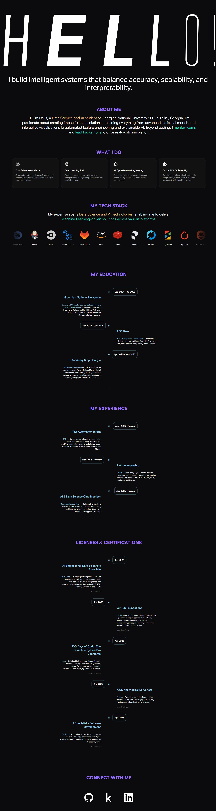

# Portfolio Website



A modern, interactive portfolio for **Davit Egoian** — Data Science and AI student — featuring custom typography animations, project showcases, and responsive layouts.

Live site: [davitegoian.tech](https://davitegoian.tech)

## Key Features

- **Dynamic hero typography** — TextPressure and VariableProximity variable-font animations
- **Projects section** — Curated from [LinkedIn](https://www.linkedin.com/in/davitegoian/) and [GitHub](https://github.com/davitegoian)
- **Spotlight cards** — Interactive hover effects across services, resume, and projects
- **Sticky navigation** — Section jump links with mobile menu
- **Tech stack carousel** — Auto-scrolling Splide slider
- **Fully responsive** — Optimized from 380px to large desktop
- **SEO** — Open Graph meta tags, JSON-LD, and sitemap
- **Accessibility** — Reduced-motion support, semantic headings, screen-reader labels

## Technologies

- React 19
- Splide.js (carousel)
- CSS Grid & Flexbox
- Variable fonts (Compressa VF, Roboto Flex, Satoshi)
- web-vitals (performance monitoring)

## Getting Started

```bash
git clone https://github.com/DavitEgoian/Portfolio-Website.git
cd Portfolio-Website
npm install
npm start
```

Open [http://localhost:3000](http://localhost:3000).

## Project Structure

```
src/
├── components/       # Section components (Hero, Projects, Navigation, …)
├── data/             # Content data (education, experience, projects, …)
├── hooks/            # Shared hooks (useViewport)
├── images/           # Icons and logos
├── App.js            # Root layout
├── App.css           # Global styles
└── index.js          # Entry point
```

## Customization

1. Edit content in `src/data/` — education, experience, certifications, projects, social links
2. Update section copy in `src/components/`
3. Adjust colors in `src/App.css`

## Testing

```bash
npm test
```

## Deployment

```bash
npm run build
npm run deploy   # gh-pages to davitegoian.tech
```

## Contact

**Davit Egoian** — [dato.egoyan@gmail.com](mailto:dato.egoyan@gmail.com)

## License

MIT License
